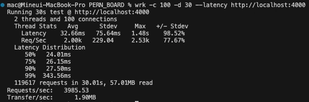
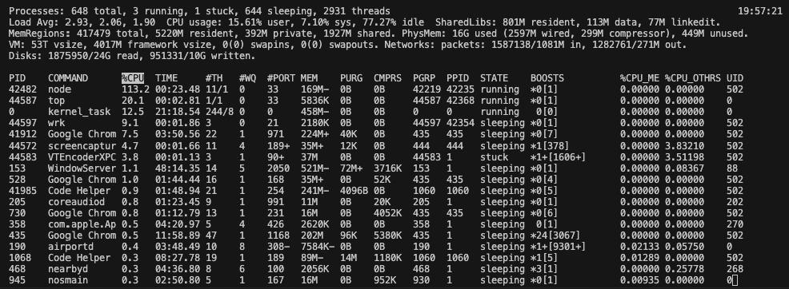
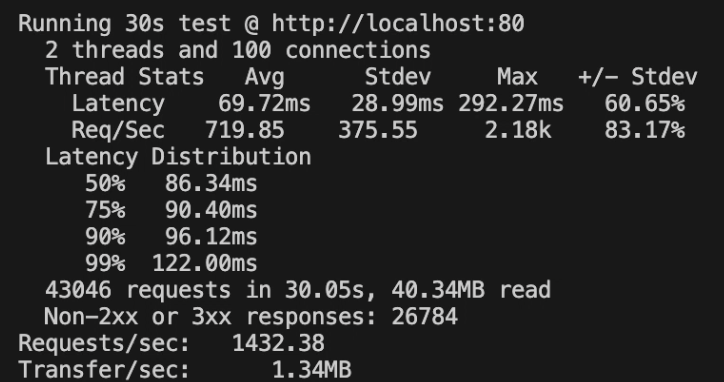
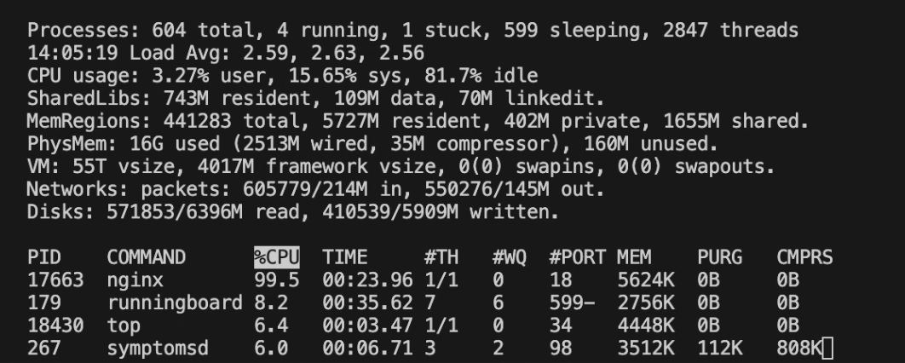

# wrk http load testing
Although the testing is premature at my current level, I'll do this for fun and for getting closer to this concept.

Currently i've implemented user operations involving the API, DB and server as well as post operations with the DB.
The user information is used whole over the app, however, the post information is fetced twice where it needed.
To minimize redundant data retrieval, I'll optimize post fetching, similar to user fetching.
I will check the improvement with testing tool `wrk`, monitoring command `top` and Chrome Dev Tools.

#### Before refactoring

#### After refactoring

But now, DB has only 4 posts. Once i increase the posts to 20, result is below:

Even it had a little progression, as data is larger performance is decreasing.
And in Chrome Dev Tools, the time until complete the transportation is about 300ms.

### After integration of a Redis
I have integrated a Redis server for caching at this point.

I fetch the user and post information when home page is mounted and use this throughout the app.

If this information saved in Redis so that subsequent requests can retreive from the cache instead of the database, Will this imporve performance? Let's find out.

In the Chrome Dev Tools, the initial transaction time is approximately 220ms. And after several requests the time gets decrease to around 120ms.

There is a slight improvement.

### After integration of a Nginx
I have implemented port forwarding on both frontend and backend using Nginx.

Typically, Nginx serves the static files (e.g. HTML, CSS, and JS) directly to clients instead of Node. It reduces the load on Node and improving efficiency for behind-the-scenes interactions.

But, in my case, i simply forwarding the port to React for simplicity, not serving the static files.

Additionally, i'm only forwarding the requests that require database interaction to Node, which can also reduce the load on Node.

I suspect that not serving the static files might be contributing to observed performance decrease.