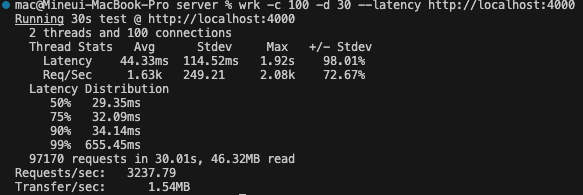
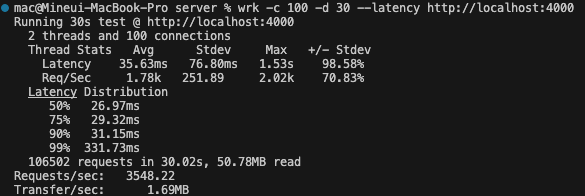
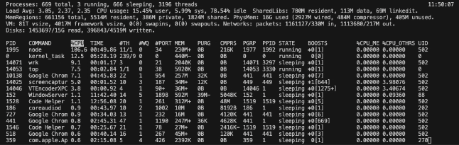
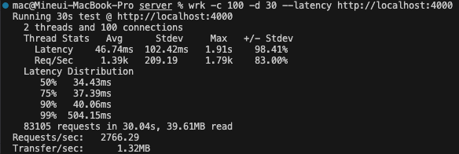

# wrk http load testing
Although the testing is premature at my current level, I'll do this for fun and for getting closer to this concept.

Currently i've implemented user operations involving the API, DB and server as well as post operations with the DB.
The user information is used whole over the app, however, the post information is fetced twice where it needed.
To minimize redundant data retrieval, I'll optimize post fetching, similar to user fetching.
I will check the improvement with testing tool `wrk`, monitoring command `top` and Chrome Dev Tools.

#### Before refactoring

#### After refactoring

But now, DB has only 4 posts. Once i increase the posts to 20, result is below:

Even it had a little progression, as data is larger performance is decreasing.
And in Chrome Dev Tools, the time until complete the transportation is about 300ms.